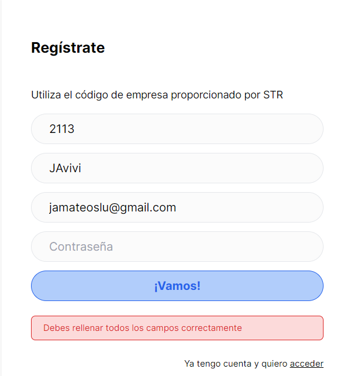
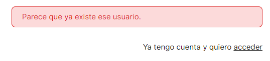

This is a [Next.js](https://nextjs.org/) project bootstrapped with [`create-next-app`](https://github.com/vercel/next.js/tree/canary/packages/create-next-app).

## Getting Started

First, run the development server:

Note: If a problem with Tailwind CSS is encountered please install PostCSS

See link below: https://flaviocopes.com/fix-postcss-webpack-ruleset-oneof/ 

Install npm by downloading the latest stabñle version: 

https://nodejs.org/en/download

Run command: 

```bash
npm install  postcss # install the postcss dependencies that allow the registration 
# When running this command version 8.4.35 works with next-auth 
# Version 10.2.3 does not work properly

```

Run command to install next-auth

```bash
npm install  next-auth # install the postcss dependencies that allow the registration
# Next-Auth version 10.5.0 funciona correctamente

```

Run command to start the login/registration server

```bash
npm run dev
# or
yarn dev
# or
pnpm dev
```

Open [http://localhost:3000](http://localhost:3000) with your browser to see the result.

You can start editing the page by modifying `app/page.js`. The page auto-updates as you edit the file.

This project uses [`next/font`](https://nextjs.org/docs/basic-features/font-optimization) to automatically optimize and load Inter, a custom Google Font.

## Learn More

To learn more about Next.js, take a look at the following resources:

- [Next.js Documentation](https://nextjs.org/docs) - learn about Next.js features and API.
- [Learn Next.js](https://nextjs.org/learn) - an interactive Next.js tutorial.

You can check out [the Next.js GitHub repository](https://github.com/vercel/next.js/) - your feedback and contributions are welcome!

## Deploy on Vercel

The easiest way to deploy your Next.js app is to use the [Vercel Platform](https://vercel.com/new?utm_medium=default-template&filter=next.js&utm_source=create-next-app&utm_campaign=create-next-app-readme) from the creators of Next.js.

Check out our [Next.js deployment documentation](https://nextjs.org/docs/deployment) for more details.


## Registration Page

Writes in MongoDB the information regarding the app users


All the data must be included, otherwise an error will appear


In case the mail already exists an error will appear



Once the user has been created successfully we will be redirected to the userLogin page

Our MongoDB User Collection will contain the information from the registration page with the defined documents/field_id


## LogIn page

On this page we will need the email and password with which we have registered


In case the user or password is incorrect we will receive a login error


In case the connection is successfull we will pass to the landing page (/dashboard)


